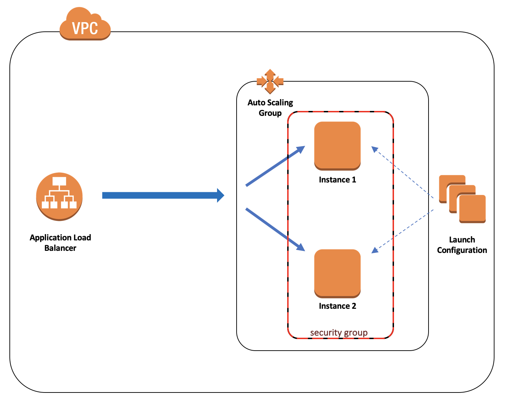

# AWS EC2 Lab
This lab is part of the [foundations trainings](https://github.com/octo-technology-downunder/octo-au-foundations) at [OCTO Technology Australia](http://careers.octo.com.au/).

## The Goal
In this lab we'll need to create a load-balanced webserver and host a simple website on it.
That will cover the following topics:
- Working with AWS Elastic Cloud Compute (EC2) service via AWS Console and aws cli
- Creating a simple webserver hosted on EC2 instance
- Creating a load balancer and auto scaling group

This lab will take approximately 60 minutes.

## Overview of technology
AWS EC2 is usually referenced to a set of services built around virtual machines. Some important terms related to EC2 service and which we'll use in the lab include:
- EC2 - instances of virtual machines
- EBS - a block storage, basically virtual disks (and their snapshots) which could be attached to EC2 instances (not used in this lab)
- AMI - images of EC2 instances
- ELB (ALB) - elastic (application) load balancers, balance traffic between instances
- TG - target groups, rules used by ALB to define path of a network traffic
- ASG - auto scaling groups, abstraction which allows to scale up and down the number of EC2 instances based on different parameters
- LC - launch configuration, contains details of instances to be created by ASG
- SG - security groups, abstraction which manages inbound and outbound network traffic rules

Let's spin up some EC2 instances to see how it works

## **_Exercise 1:_ Create a simple website on a standalone EC2 instance**
This is a basic scenario, but it's important to understand main concepts and be able to tackle more complex cases<br>
Our HTTP server will consist of a single host and be based on Apache HTTP server<br>
Let's do that!

### Launch an EC2 instance
* Open https://console.aws.amazon.com/ and log in to your AWS account<br>
* Select Services -> EC2 in drop down menu or search for EC2 in service finder
* In opened page you will see a EC2 home page and also a list of services on the left and
* Make sure you're in the Asia Pacific (Sydney) region. It's also referenced as `ap-southeast-2`, e.g. in url box of your browser
* Select `Instances` on the left, then click `Launch Instance`
* Choose your AMI (e.g. free tier Amazon Linux), then choose your instance size (e.g. `t2.micro`)
* In one of the next pages you will be able to edit Tags. Add a tag with key `Name` and value `foundation-labs-ec2-<your_name>`
* Just before you launch an instance, you will be asked to choose a key pair. These are credentials to access the instance in the future. Choose to create a new one and give it a name `foundation-labs-kp-<your_name>`. Download a credentials file in the same popup window

Awesome! You've gone through the steps and created a EC2 instance!<br>
Now you can see it in the instances list:<br>
<br>

### Create a simple HTTP server
Having a EC2 instance running, let's now install and launch a Apache HTTP server with a simple page:
* In AWS Console, go to EC2 service and find your EC2 instance. Click on it and on Description tab find and copy a `IPv4 Public IP` field value. We'll be referencing this value as `<your_ec2_ip>`
* Open your terminal and type `ssh ec2-user@<your_ec2_ip> -i <path_to_credentials>` where <br>
  * `ec2-user` is a privileged user name for Amazon Linux
  * `<your_ec2_ip>` is a IP address of your instance copied above,
  * `<path_to_credentials>` is a path to a credentials file you downloaded during EC2 instance creation
* Accept a security prompt to add a host to the list of trusted ones
* If you see a `bad permissions` error, you would need to do `chmod 400 <path_to_credentials>` on your credentials file. Then try to ssh again. If everything is fine, you'll see a Amazon Linux prompt:
```
       __|  __|_  )
       _|  (     /   Amazon Linux 2 AMI
      ___|\___|___|
```
* To make our life easier for this lab, switch to root:<br> `sudo su -`
* Update your kernel as suggested in the prompt:<br>`yum update`
* Install Apache HTTP server:<br>`yum install httpd`
* Run Appache HTTP server on default port `80`:<br> `service httpd start`
* Create a simple HTML page in server's directory:<br>
`cd /var/www/html`<br><br>
`touch index.html`<br><br>
`echo ' `<br>
`<html> `<br>
`<head></head> `<br>
`<body><h2>Hello OCTO!</h2><h3>This is my AWS EC2 based website!</h3></body> `<br>
`</html>' > index.html`

The last thing you need is to allow external HTTP traffic to your EC2 instance - by default only ssh is allowed:
* In AWS Console, go to EC2 service and find your EC2 instance. Click on it and on Description tab find Security Groups field. Click on the security group associated with instance. It may have some default name like `launch-wizard-NN`
* On Inbound tab click Edit, then Add Rule and add a new HTTP rule on port 80 from 0.0.0.0/0 source:<br>
<br>

Now copy `Public DNS (IPv4)` value from your instance and paste into URL of your browser - you should be able to see your HTML page!<br>
<br>

### Terminate instance via AWS CLI
Before we move forward, let's cleanup our workspace and terminate our EC2 instance. The only trick is that we're going to use command line for that<br>
Assuming you've [installed](https://docs.aws.amazon.com/cli/latest/userguide/installing.html) and [configured](https://docs.aws.amazon.com/cli/latest/userguide/cli-chap-getting-started.html
) AWS CLI, commands will be as follows:
* Describe EC2 instances:<br>
`aws ec2 describe-instances`<br>
* This command would probably return too much information which is hard to handle. So, let's refine our request by adding region parameter and filter by instance name (don't forget to replace <your_name> in the instance name):<br>
```aws ec2 describe-instances --region ap-southeast-2 --output json --query 'Reservations[?Instances[?Tags[?Key==`Name` && Value==`foundation-labs-ec2-<your_name>`]]].{InstanceId:Instances[0].InstanceId,Name:Instances[0].Tags[0].Value}'```<br>
A bit more code, huh?? But we've got only values we need: `InstanceId` of the instance we want to stop and the name. For more information please check out [AWS CLI page](https://docs.aws.amazon.com/cli/latest/userguide/controlling-output.html)
* Terminate EC2 instance with the following command (replace instance-ids value with the one from the previous command output):<br>
`aws ec2 terminate-instances --instance-ids i-002b70c9b39e96793`<br>

<h4>Well done! Let's move to the next challenge!</h4>

## **_Exercise 2:_ Create load-balanced web application**
Here is a diagram of a solution we're going to build:<br>
<br>

Let's do that!

### Create Launch Configuration
* In AWS Console, go to `EC2` service
* Click on `Launch Configurations` in the left panel, then `Create launch configuration`
* `Choose AMI` step:
  * Select `Amazon Linux 2 AMI`
* `Choose Instance type` step:
  * Select `t2.micro`
* `Configure details` step:
  * Specify `Name` as `foundation-labs-ec2-lc-<your_name>`
  * Advanced Details: set `User data` as follows:<br>
```
#!/bin/bash
sudo yum update
sudo yum install -y httpd
sudo service httpd start
sudo chkconfig httpd on
sudo touch /var/www/html/index.html
sudo echo '
<html>
<head></head>
<body><h2>Hello OCTO!</h2><h3>This is my AWS EC2 load balanced website!</h3>This page is served from instance <b>'`curl http://169.254.169.254/latest/meta-data/public-hostname)`'</b></body>
</html>' > /var/www/html/index.html
```
  * Advanced Details: `IP Address Type` -> `Do not assign a public IP address to any instances`
* `Configure Security Group` step:
  * Select `Create a new security group`
  * Set `Security group name` as `foundation-labs-ec2-sg-<your_name>`
  * Add rule: `Type` -> `HTTP` and `Port Range` -> `80` and `Source` -> `Anywhere, 0.0.0.0/0`
* Proceed with all other options as default, in one of the final screens you will be asked for `Key-Pair`: select existing one, which we created previously for our single EC2 instance (`foundation-labs-kp-<your_name>`)

### Create Application Load Balancer
* In AWS Console, go to `EC2` service
* Click on `Load balancers` in the left panel, then `Create Load Balancer`
* Choose `Application Load Balancer`, as we want to use it with http traffic for our website
* `Configure Load Balancer` step:
  * Set Name as `foundation-labs-lb-<your_name>`. Add `Name` tag with same value
  * Choose `internet-facing` schema
  * Select `default` VPC and put checkboxes against all availability zones
  * Listener should be pointing to `HTTP:80`
* `Configure Security Groups` page:
  * Create a new group with name `foundation-labs-sg-<your_name>`, put the same in description
  * Leave default rule as is (HTTP:80)
* `Configure Routing` page:
  * Select `New target group`. Set name as `foundation-labs-tg-<your_name>`
  * Set `protocol` and `port` to `HTTP` and `80` respectively
  * Set `Target type` to `instance`
  * Health check as default: `HTTP`, `/`
* Finalise and create Load Balancer

It'll take some time for AWS to provision our load balancer, so keep an eye on its status in the `Load Balancers` list. We're ready to go when it's changed to `active`

### Create Auto Scaling Groups
* In AWS Console, go to `EC2` service
* Click on `Auto Scaling Groups` in the left panel, then `Create Auto Scaling Groups`, then select `Launch Configuration` option
* Select `Use an existing launch configuration` and in the list below select the one we've created in one of the previous steps
* `Configure Auto Scaling group details` page:
  * Set `Group name` as `foundation-labs-ec2-asg-<your_name>`
  * Set `Group size = 2`
  * Select `default` VPC in Network field
  * Select one of the subnets
  * Advanced Details: `Load Balancing` -> `Receive traffic from one or more load balancers`
  * Advanced Details: `Target Groups` -> `foundation-labs-ec2-tg-<your_name>`
* `Configure Tags` page:
  * Add `Name` tag with `foundation-labs-ec2-asg-<your_name>` value. Make sure that `Tag instances` is checked
* Finalise and create our Auto Scaling Group

Now you can click on your new ASG in the list and check that `Instances` tab displays 2 instances being provisioned

### Test your website
In the steps above, we've created a load balanced web application which receives traffic from internet and redirects it to instances of auto scaling group in round-robin manner. To verify that, we'll query our load balancer endpoint few times in a row and check that web page is served from different instances:
* In AWS Console, go to `EC2` service
* Click on `Load balancers` in the left panel, then on load balancer we've created earlier
* Copy `DNS Name` value and paste it into browser's URL field. It should display a page from one of the instances
* If you reload a page few times, you'd see that instance name has changed, as it's directed by load balancer to a different instance:
<br>

#### Congratulations!!! You've successfully created and tested a load balanced application!
<br>

### Clean up the workspace
To conclude our lab, let's delete all resources we've created so far. Here is an order of actions to perform:
* Delete Load Balancer
* Delete Auto Scaling Group (it also terminates related instances)
* Delete Launch Configuration
* Delete Target Group
* Delete Security Group
* Delete Key Pair (you can leave it and use for future tasks)

## Well done!
This concludes our AWS EC2 lab<br>
Feel free to create issues if you found any problems or have suggestions on the lab improvements<br>
Also don't hesitate to submit pull requests to this repo ;)  
